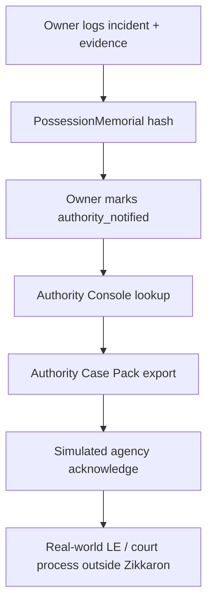
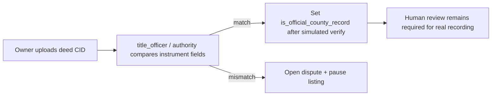
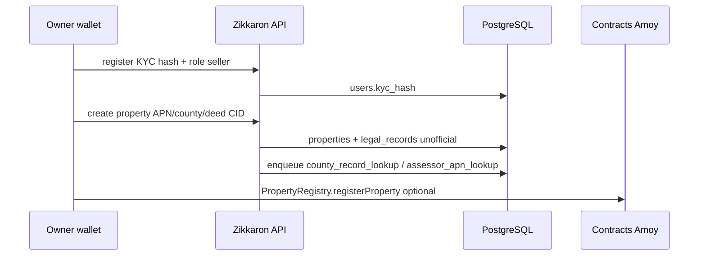
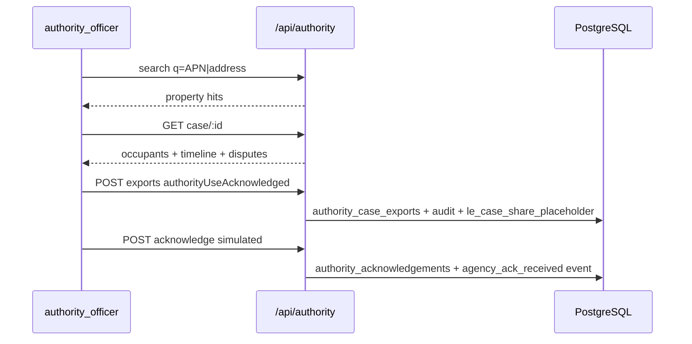

# Flows — Zikkaron

## Occupancy → authority assist

## Recorder assist (simulated)

## Owner KYC → property memorial

## Authority Case Pack

## Purchase deal (testnet)

Seller opens deal with `disclaimerAccepted` + `fraudWarningAcknowledged`. API soft-warns on unverified KYC, elevated fraud risk, paused listings, open disputes. Reminders: TESTNET FUNDS, NOT A CLOSING; wire-fraud out-of-band verification.
